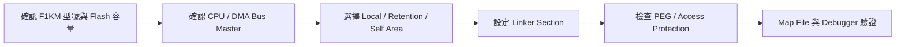
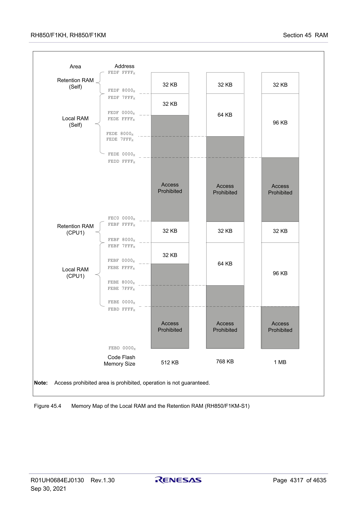
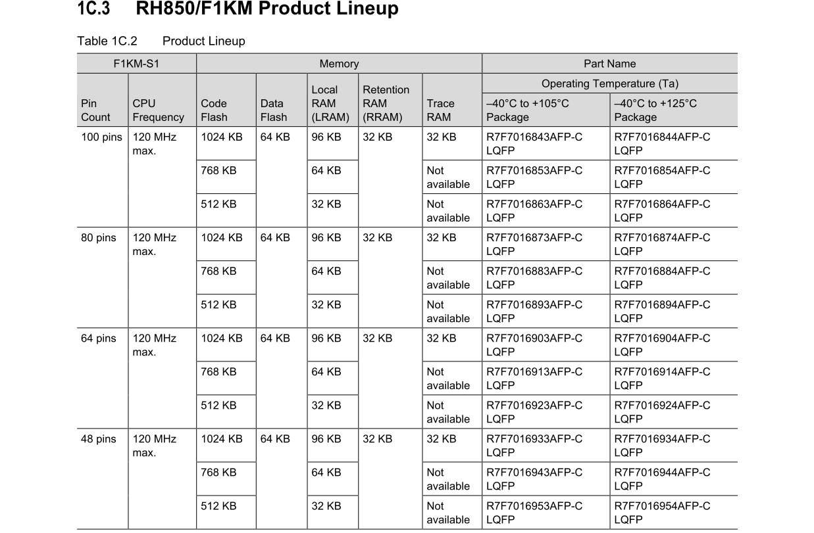
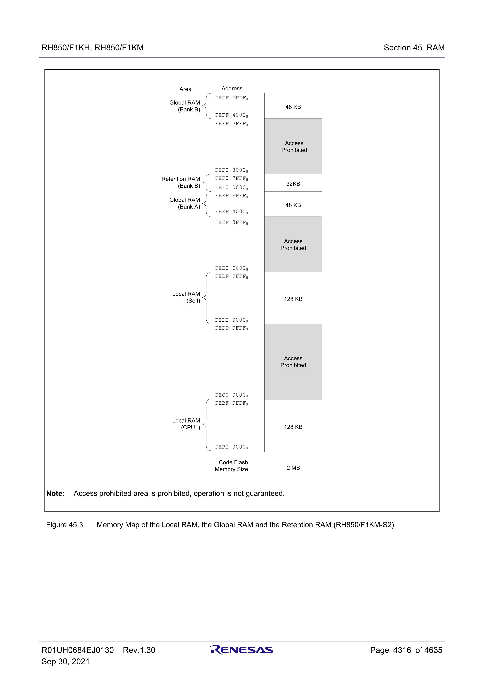
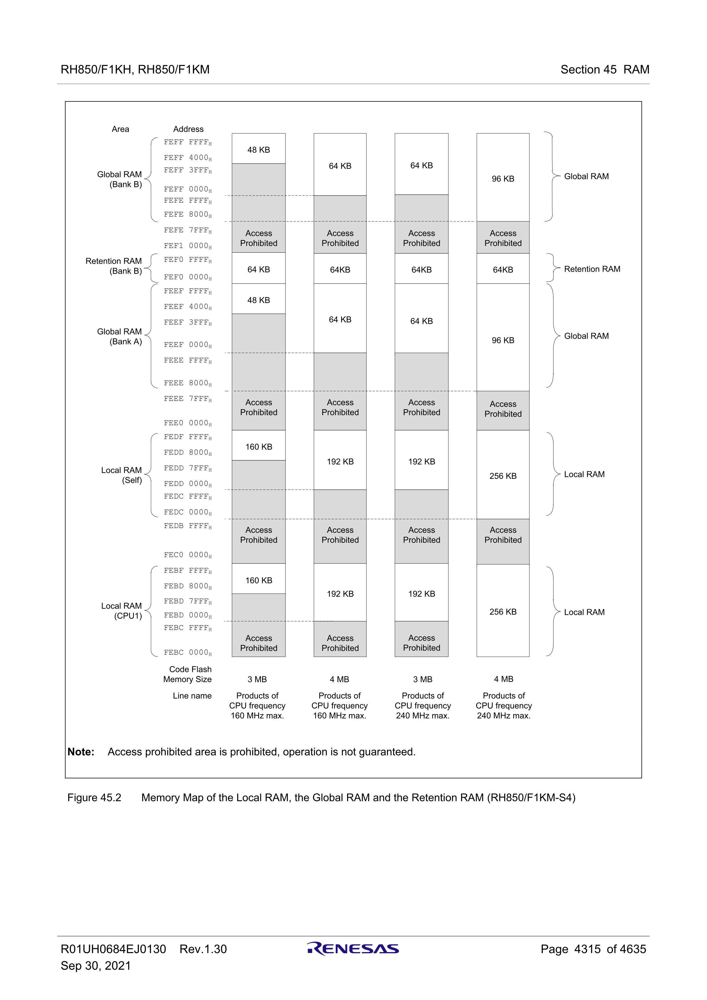
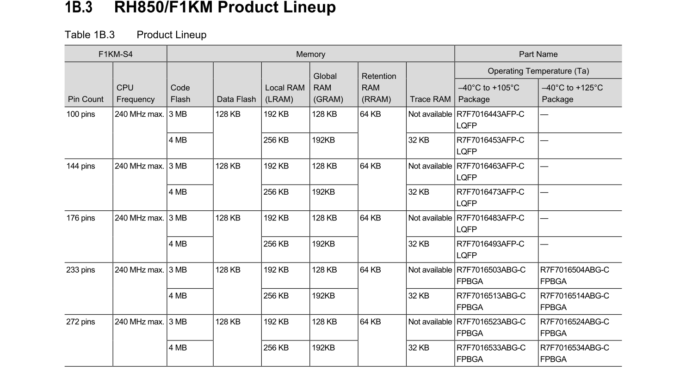
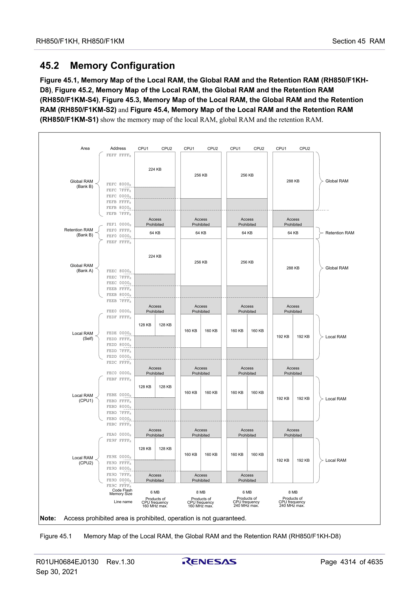
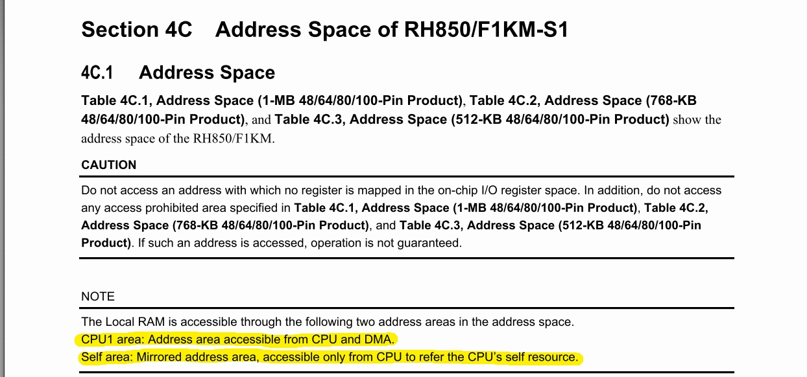

[回到知識庫總索引](https://released.github.io/)

# RH850/F1KM memory map

> 整理 RH850/F1KM-S1 不同 Flash 容量下的 local RAM、retention RAM、self area 與 bus-master view，協助 linker 配置、DMA buffer 與存取保護除錯。

## 位址判讀流程

## Agenda

* [Memory map](#article_mem_map)

---

## Memory map (RH850/F1KM-S1)

CPU1 view：

| FLASH | LOCAL RAM (CPU1) | RETENTION RAM (CPU1) |
|---:|---|---|
| 512K | `0xFEBF0000 ~ 0xFEBF7FFF` | `0xFEBF8000 ~ 0xFEBFFFFF` |
| 768K | `0xFEBE8000 ~ 0xFEBF7FFF` | `0xFEBF8000 ~ 0xFEBFFFFF` |
| 1MB | `0xFEBE0000 ~ 0xFEBF7FFF` | `0xFEBF8000 ~ 0xFEBFFFFF` |

SELF view：

| FLASH | LOCAL RAM (SELF) | RETENTION RAM (SELF) |
|---:|---|---|
| 512K | `0xFEDF0000 ~ 0xFEDF7FFF` | `0xFEDF8000 ~ 0xFEDFFFFF` |
| 768K | `0xFEDE8000 ~ 0xFEDF7FFF` | `0xFEDF8000 ~ 0xFEDFFFFF` |
| 1MB | `0xFEDE0000 ~ 0xFEDF7FFF` | `0xFEDF8000 ~ 0xFEDFFFFF` |

### Memory map + Product lineup memo

Source:
- `REN_r01uh0684ej0130-rh850f1kh-rh850f1km_MAH_20210929.pdf`
- Section `1A/1B/1C.3 Product Lineup`
- Section `45.2 Memory Configuration` (Figure `45.1` to `45.4`)

#### F1KM-S1

RAM 位址依 Code Flash 容量變化，請對照本節前方的 Memory map 表。Part Name 另依 pin count 與溫度等級列示：

| Pin count | Code Flash | 105°C Part Name | 125°C Part Name |
|---:|---:|---|---|
| 100 | 512K | `R7F7016863AFP-C` | `R7F7016864AFP-C` |
| 100 | 768K | `R7F7016853AFP-C` | `R7F7016854AFP-C` |
| 100 | 1MB | `R7F7016843AFP-C` | `R7F7016844AFP-C` |
| 80 | 512K | `R7F7016893AFP-C` | `R7F7016894AFP-C` |
| 80 | 768K | `R7F7016883AFP-C` | `R7F7016884AFP-C` |
| 80 | 1MB | `R7F7016873AFP-C` | `R7F7016874AFP-C` |
| 64 | 512K | `R7F7016923AFP-C` | `R7F7016924AFP-C` |
| 64 | 768K | `R7F7016913AFP-C` | `R7F7016914AFP-C` |
| 64 | 1MB | `R7F7016903AFP-C` | `R7F7016904AFP-C` |
| 48 | 512K | `R7F7016953AFP-C` | `R7F7016954AFP-C` |
| 48 | 768K | `R7F7016943AFP-C` | `R7F7016944AFP-C` |
| 48 | 1MB | `R7F7016933AFP-C` | `R7F7016934AFP-C` |

#### F1KM-S2

RAM configuration：

| Code Flash | LOCAL RAM (CPU1) | RETENTION RAM (Bank B) | LOCAL RAM (SELF) |
|---:|---|---|---|
| 2MB | `0xFEBE0000 ~ 0xFEBFFFFF` | `0xFEF08000 ~ 0xFEF0FFFF` | `0xFEDE0000 ~ 0xFEDFFFFF` |

| Code Flash | GLOBAL RAM (Bank A) | GLOBAL RAM (Bank B) |
|---:|---|---|
| 2MB | `0xFEEF4000 ~ 0xFEEFFFFF` | `0xFEFF4000 ~ 0xFEFFFFFF` |

Product lineup：

| Pin count | Code Flash | 105°C Part Name | 125°C Part Name |
|---:|---:|---|---|
| 100 | 2MB | `R7F7017603AFP-C` | — |
| 144 | 2MB | `R7F7017623AFP-C` | — |
| 176 | 2MB | `R7F7017643AFP-C` | — |

#### F1KM-S4

RAM configuration：

| Code Flash | LOCAL RAM (CPU1) | RETENTION RAM (Bank B) | LOCAL RAM (SELF) |
|---:|---|---|---|
| 3MB | `0xFEBD0000 ~ 0xFEBFFFFF` | `0xFEF00000 ~ 0xFEF0FFFF` | `0xFEDD0000 ~ 0xFEDFFFFF` |
| 4MB | `0xFEBC0000 ~ 0xFEBFFFFF` | `0xFEF00000 ~ 0xFEF0FFFF` | `0xFEDC0000 ~ 0xFEDFFFFF` |

| Code Flash | GLOBAL RAM (Bank A) | GLOBAL RAM (Bank B) |
|---:|---|---|
| 3MB | `0xFEEF0000 ~ 0xFEEFFFFF` | `0xFEFF0000 ~ 0xFEFFFFFF` |
| 4MB | `0xFEEE8000 ~ 0xFEEFFFFF` | `0xFEFE8000 ~ 0xFEFFFFFF` |

Product lineup：

| Pin count | Code Flash | 105°C Part Name | 125°C Part Name |
|---:|---:|---|---|
| 100 | 3MB | `R7F7016443AFP-C` | — |
| 100 | 4MB | `R7F7016453AFP-C` | — |
| 144 | 3MB | `R7F7016463AFP-C` | — |
| 144 | 4MB | `R7F7016473AFP-C` | — |
| 176 | 3MB | `R7F7016483AFP-C` | — |
| 176 | 4MB | `R7F7016493AFP-C` | — |
| 233 | 3MB | `R7F7016503ABG-C` | `R7F7016504ABG-C` |
| 233 | 4MB | `R7F7016513ABG-C` | `R7F7016514ABG-C` |
| 272 | 3MB | `R7F7016523ABG-C` | `R7F7016524ABG-C` |
| 272 | 4MB | `R7F7016533ABG-C` | `R7F7016534ABG-C` |

#### F1KH-D8

RAM configuration：

| Code Flash | LOCAL RAM (CPU1) | LOCAL RAM (CPU2) | RETENTION RAM (Bank B) |
|---:|---|---|---|
| 6MB | `0xFEBD8000 ~ 0xFEBFFFFF` | `0xFEDD8000 ~ 0xFEDFFFFF` | `0xFEF00000 ~ 0xFEF0FFFF` |
| 8MB | `0xFEBD0000 ~ 0xFEBFFFFF` | `0xFEDD0000 ~ 0xFEDFFFFF` | `0xFEF00000 ~ 0xFEF0FFFF` |

| Code Flash | GLOBAL RAM (Bank A) | GLOBAL RAM (Bank B) |
|---:|---|---|
| 6MB | `0xFEEC0000 ~ 0xFEEFFFFF` | `0xFEFC0000 ~ 0xFEFFFFFF` |
| 8MB | `0xFEEB8000 ~ 0xFEEFFFFF` | `0xFEFB8000 ~ 0xFEFFFFFF` |

Product lineup：

| Pin count | Code Flash | 105°C Part Name | 125°C Part Name |
|---:|---:|---|---|
| 176 | 6MB | `R7F7017083AFP-C` | — |
| 176 | 8MB | `R7F7017093AFP-C` | — |
| 233 | 6MB | `R7F7017103ABG-C` | `R7F7017104ABG-C` |
| 233 | 8MB | `R7F7017113ABG-C` | `R7F7017114ABG-C` |
| 324 | 6MB | `R7F7017143ABG-C` | `R7F7017144ABG-C` |
| 324 | 8MB | `R7F7017153ABG-C` | `R7F7017154ABG-C` |

CPU1 area vs Self area

DMA access area (only allow access __CPU1 area__)

[back to top](#article_top)

---

